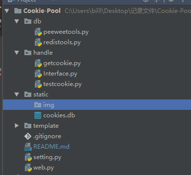
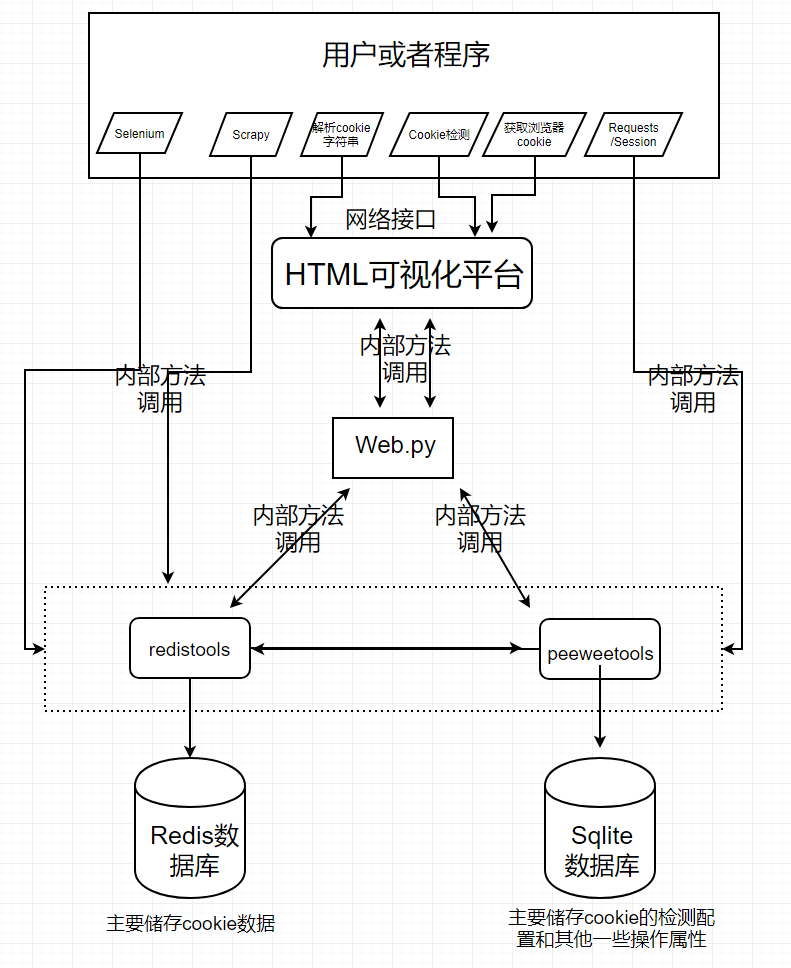
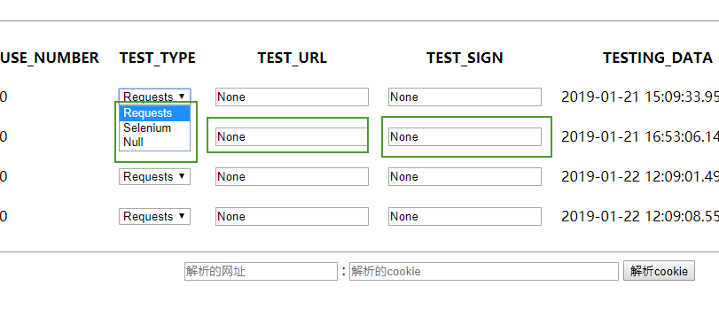
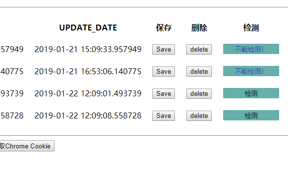

# Cookie-Pool
一个强大的Cookie池项目，超乎你的想象

## 1 综述
随着大型网站反扒机制的增强，使用cookie登陆已经成为一种最高效的方式，为此打造一款超强cookie池项目

基于tornado网络框架，综合了<B>selenium、requests、Session、scrapy、cookie字符串、浏览器cookie</B>

把六中来源的cookie统一为一种格式，并通过tornado开发的控制台，来提供cookie检测设置和可视化

本项目分为cookie获取部分、存储部分、可视与中控部分、预留自动登录获取部分

## 2 文件目录结构说明

### 2.1 db
peeweetools:封装了操作sqlite的基本方法和函数

redistools: 封装了redis的基本方法和函数
### 2.2 handle
getcookie:封装了从本地浏览器、requests、session、webdriver、cookie字符串中获取cookie的方法

interface:封装了协调调用sqlite、redis的方法，是在peeweetools、redistools的基础上再次封装主要实现存放cookie和获取cookie的函数
testcookie：定义了用于测试cookie的类
### 2.4 static
静态文件目录，存放sqlite
### 2.5 template
可视化的html模板文件，用于tornado渲染
### 2.6 setting.py
配置文件
### 2.7 web.py
主程序文件，实现调度和网页操作、后台操作的相关接口

## 3 架构说明

用两种方式与用户交互：1.条用web接口 2.调用内部方法

selenium、requests、Session、scrapy的cookie存放目前只能通过调用内部方法

获取Chrome浏览器cookie，解析cookie字符串可通过在线操作和内部方法来实现

## 4 前端视图

配置检测方式：selenium、requests

检测的URL、打开URL后标志性的字段

配置检测之后点击保存，然后可以检测了

如果没有配置检测方式及其字段是不能够检测的

